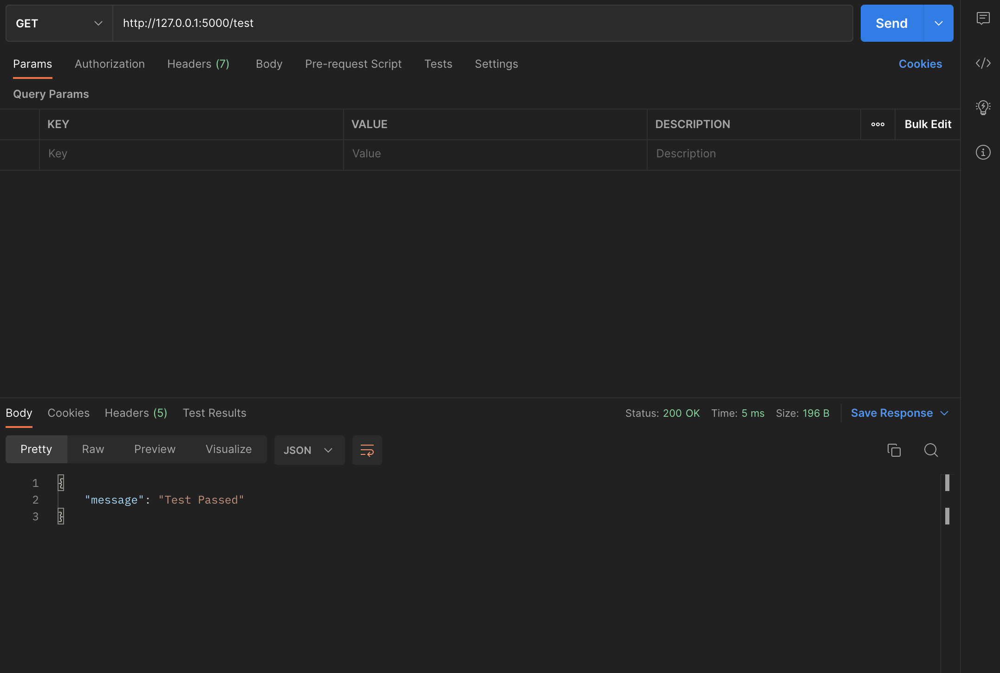

I have created the [api.py](apis/apis.py) in which I have impleented all task which was given in folder [Supporting Document (QUESTION)](<Supporting Documents (QUESTION)/essay_based_prompt_and_csv.docx>) All the implementation results are shown in [Screenshots](ScreenShots) folder.

POSTMAN Apis Calls:
Test_API:
http://127.0.0.1:5000/test
here is the image of: 

Upload_CSV:
http://127.0.0.1:5000/upload_csv
In "Body" key set as file and upload the csv file. like in the 

Generate Essay:
http://127.0.0.1:5000/generate_essay
In "Body" select 'raw' then add your prompt: as shown in [Uploading CSV.png](<ScreenShots/Generate Essay.png>)"

Report of this implementation is there: [Documentation](<Documentation for the Flask-based Essay Generation API /Flask-based Essay Generation API Documentation.pdf>)
I have implement LLM "EleutherAI/gpt-neo-1.3B" for the APIs implementation.

[Regards:]

Muhammad Fayzan
+923046043943
imfayzanbhatti@gmail.com
Software Engineer from COMSTAS University